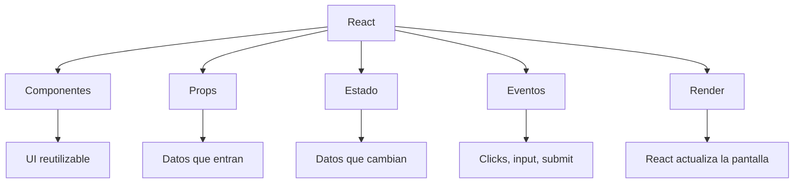
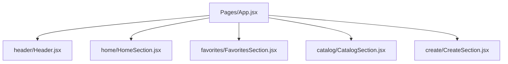

# 01 - Mapa Conceptual De React

## React en una frase

React es una forma de construir interfaces dividiendo la pantalla en componentes pequenos que reciben datos y devuelven UI.

## Mapa conceptual principal



## Mapa mental rapido

```text
React
├── Componentes = piezas de interfaz
├── Props = informacion que entra a una pieza
├── State = informacion que cambia dentro de una pieza
├── Eventos = acciones del usuario
└── Render = React vuelve a dibujar la UI
```

## Idea clave para explicarle a alguien

Una pagina en React se puede explicar como si fuera una caja de LEGO:

- cada pieza pequena es un componente
- unas piezas contienen a otras
- algunas piezas reciben informacion para mostrarse distinto
- cuando la informacion cambia, la pieza se vuelve a dibujar

## Mapa del proyecto actual



## Frases utiles para ensenar

- "Un componente es una pieza de pantalla."
- "Props son los datos que le pasas a esa pieza."
- "State es la memoria interna de un componente."
- "React vuelve a renderizar cuando cambian datos importantes."

## Preguntas para comprobar comprension

1. Si divido una pagina en piezas, como se llama cada pieza en React?
2. Si quiero pasar un titulo a una pieza, uso props o state?
3. Si el usuario hace click, eso es un evento o una prop?
4. Si cambia el state, que hace React con la interfaz?
