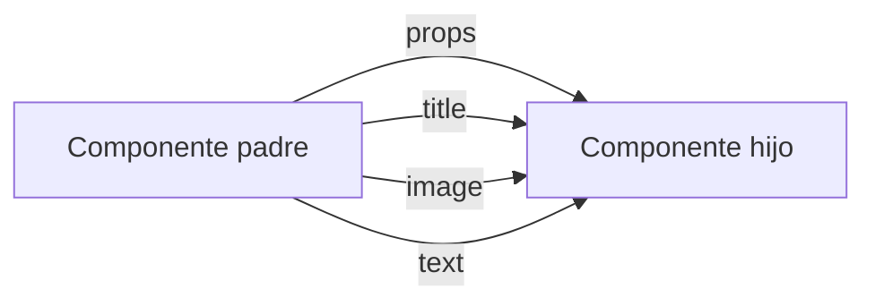

# 02 - JSX, Componentes Y Props

## 1. JSX

JSX es una forma de escribir algo parecido a HTML dentro de JavaScript.

Ejemplo mental:

```jsx
const titulo = <h1>Hola</h1>;
```

No es HTML puro. React lo transforma para construir la interfaz.

## 2. Componente

Un componente es una funcion que retorna JSX.

Ejemplo simple:

```jsx
export const Saludo = () => {
  return <h1>Hola</h1>;
};
```

Idea para explicarlo:
- una funcion normal devuelve datos
- un componente devuelve interfaz

## 3. Props

Las props son datos que un componente recibe desde afuera.

Ejemplo simple:

```jsx
export const Saludo = ({ nombre }) => {
  return <h1>Hola {nombre}</h1>;
};
```

Uso:

```jsx
<Saludo nombre="Ana" />
```

## 4. Ejemplo real del proyecto

En este proyecto, un ejemplo muy claro es `CatalogCard`.

Recibe:
- `image`
- `title`
- `text`
- `buttonLabel`

Eso significa:
- el componente es la plantilla visual
- las props son los datos que cambian

Mentalmente:

```text
CatalogCard = molde
props = contenido que metes en el molde
```

## 5. Otro ejemplo real

`SectionHeading` tambien es ideal para ensenar props.

Recibe:
- `eyebrow`
- `title`

Con eso puedes explicar:
- el componente no esta "pegado" a un solo texto
- se reutiliza porque acepta informacion distinta

## 6. Mini mapa de props



## 7. Analogias utiles

Componentes:
- como muebles de una casa
- como bloques de LEGO
- como piezas de una maqueta

Props:
- como instrucciones o etiquetas que le dices a una pieza
- como ingredientes que entran a una receta

## 8. Diferencia facil de recordar

Props:
- vienen desde afuera
- el componente las recibe

State:
- vive adentro del componente
- el componente lo controla

## 9. Mini ejercicio

Pregunta:
- si `CatalogCard` recibe una imagen distinta, cambia la estructura o solo cambia el contenido?

Respuesta esperada:
- cambia el contenido, no la estructura

## 10. Ejercicio practico para ella

Pidele que imagine este componente:

```jsx
export const Boton = ({ texto, color }) => {
  return <button className={color}>{texto}</button>;
};
```

Preguntale:
- cual es el componente?
- cuales son las props?
- que cambiaria si uso `<Boton texto="Entrar" color="btn-primary" />`?
