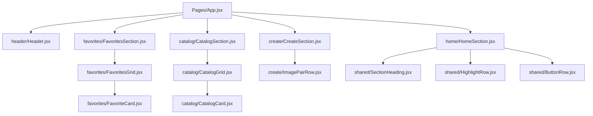

# 03 - Composicion En Este Proyecto

## Idea principal

Este repo sirve muy bien para ensenar componetizacion porque muestra varios niveles:

- `App` ensambla secciones grandes
- cada seccion usa componentes compartidos
- algunas secciones usan componentes hijos propios

## Mapa de composicion

## Como explicarlo paso a paso

### Nivel 1: la pagina completa

Abrir `src/Pages/App.jsx` y explicar:

- `App` no hace todo
- `App` ordena piezas
- cada linea importada representa una parte de la interfaz

Mensaje didactico:
- "React piensa la pantalla como un arbol de componentes"

### Nivel 2: una seccion

Abrir `src/components/home/HomeSection.jsx` y explicar:

- una seccion tambien puede usar varios componentes pequenos
- React no limita cuantas capas de componentes puedes tener

Mensaje didactico:
- "Un componente puede contener otros componentes"

### Nivel 3: piezas reutilizables

Abrir `src/components/shared/SectionHeading.jsx` y luego una seccion que lo use.

Explicacion:
- varias secciones repiten el mismo patron visual
- en vez de copiar JSX, extraemos un componente

Mensaje didactico:
- "Reutilizar no es copiar y pegar, es abstraer"

### Nivel 4: grids y cards

Abrir:
- `src/components/favorites/FavoritesGrid.jsx`
- `src/components/favorites/FavoriteCard.jsx`

Explicacion:
- `FavoritesGrid` organiza
- `FavoriteCard` representa una sola unidad

Mensaje didactico:
- "Un componente padre distribuye y un componente hijo pinta una unidad"

## Caso de uso real para explicar

Supongamos que quieres mostrar 20 canciones favoritas.

No conviene:
- escribir 20 bloques JSX manuales

Si conviene:
- tener un arreglo de datos
- recorrerlo con `map`
- renderizar una card por item

Eso ya pasa mentalmente en:
- `FavoritesGrid`
- `CatalogGrid`

## Regla simple para ella

Si algo se repite:
- probablemente merece un componente

Si algo cambia por datos:
- probablemente necesita props

Si algo solo ordena hijos:
- probablemente es un componente contenedor

## Mini ejercicio guiado

Preguntale:

1. `App` pinta detalles de una card o solo organiza grandes bloques?
2. `FavoriteCard` deberia saber cuantas cards existen?
3. `FavoritesGrid` deberia conocer el texto exacto de cada card o recibirlo por datos?
