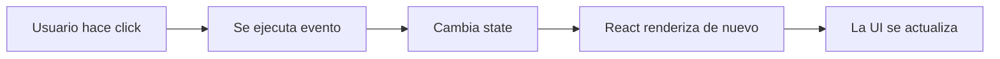

# 04 - Estado, Eventos Y Render

## Importante

Este proyecto actual esta muy enfocado en componetizacion y props. Aun asi sirve para introducir `state`, eventos y render sin necesidad de cambiar toda la app.

## 1. Evento

Un evento es algo que hace el usuario:

- click
- escribir en un input
- enviar un formulario
- mover el mouse

Ejemplo:

```jsx
<button onClick={() => console.log("click")}>Click</button>
```

## 2. State

El state es informacion que vive dentro de un componente y puede cambiar.

Ejemplo:

```jsx
import { useState } from "react";

export const Contador = () => {
  const [numero, setNumero] = useState(0);

  return (
    <button onClick={() => setNumero(numero + 1)}>
      {numero}
    </button>
  );
};
```

## 3. Render

Render significa que React calcula de nuevo que debe mostrarse en pantalla.

Secuencia mental:



## 4. Diferencia clave

Props:
- vienen del padre
- el hijo las recibe

State:
- vive en el componente
- el componente lo actualiza

## 5. Como conectarlo con este proyecto

Aunque aqui no hay mucho state todavia, puedes usar ejemplos imaginarios:

### Ejemplo A

En `HeaderActions`:
- el input podria guardar lo que escribe la persona

### Ejemplo B

En `FavoritesSection`:
- un click en el corazon podria agregar o quitar favoritos

### Ejemplo C

En `CatalogSection`:
- un filtro podria mostrar solo ciertas cards

## 6. Caso de uso didactico

Explicale esto:

```text
Sin state:
la interfaz muestra datos fijos

Con state:
la interfaz responde a lo que hace el usuario
```

## 7. Preguntas utiles

1. Si el usuario escribe en un input, eso es un evento o state?
2. Si el texto del input se guarda y cambia, eso donde vive?
3. Si ese valor cambia, que hace React con la pantalla?

## 8. Micro reto

Pidele que imagine este caso:

- un boton dice "Mostrar mas"
- al hacer click aparece un texto oculto

Preguntas:
- que evento usarias?
- que state necesitarias?
- cuando re-renderiza React?
